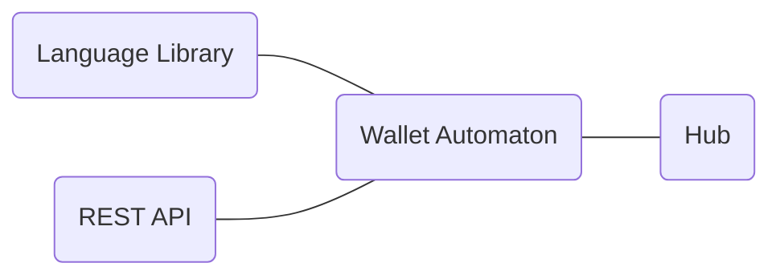

# Liquidity SDK


## About

Liquidity Network revolutionizes the way people trade and interact.  Through its network of payment hubs, Liquidity Network enables free,  instant and secure off-chain transfers and exchange of digital assets  and makes people custodian of their own funds.

We believe in the potential of off-chain technology to ensure  inclusion and trust minimization. We envision a future where everyone is  able to perform money transfers, without the need of a bank account and  free of expensive transaction fees or long waiting times.

To bring this vision to life, we strongly encourage collaboration and  stimulate developers to work on and implement our technology. The present documentation goes over all methods available for you to start working on it today!


## Liquidity SDK

Liquidity SDK allows you to easily integrate offchain payments and exchanges within your application. It is divided in two different parts. The **wallet automaton** is a self-hosted liquidity wallet management tool for your transactions. The **Liquidity language library** allows you to access wallet automaton directly from your favorite language or from *REST* endpoints.




### Architecture

Liquidity is build around hubs creating a link between blockchain and offchain transaction ecosystem. Blockchain remains the ultimate source of trust in case of conflict while hub manage offchain state of network participants. To leverage the complexity of an active state management, the wallet automaton is querying the hub to get its last state. It serves this up-to-date state through REST endpoint the language library is using.

To give a more concrete example, the flow to perform a full transfer of *32 wei* to a specific user is given below. Language Library is considered to be the end user.

```sequence
participant Language Library
participant Wallet Automaton
participant Hub
Language Library -> Wallet Automaton: GET /transfers/0x123...aBC/32
Wallet Automaton -> Wallet Automaton: Creates the transfer
Wallet Automaton -> Hub: Send transfer
Wallet Automaton --> Hub: Any updates?
Hub -> Wallet Automaton: Update: Transfer confirmed
Language Library --> Wallet Automaton: GET /transfers/list?status=pending
Wallet Automaton -> Language Library: []
```

1. The user ask the automaton to perform a transfer of 32 wei
2. The automaton creates the transfer
3. The automaton sends the transfer
4. At regular interval, the automaton checks if the hub has included the transfer
5. When the transfer is included in an update, the automaton notice it
6. When the user checks if there is any pending transfer, none is returned because its transfer has been performed

If something bad happends during the process, the user is able to contact the automaton and perform security associated operations.

### Wallet automaton

Liquidity network provides you with a non custodian payment system. Its core component is the wallet automaton through which the user can perform operations on the network while remaining in control of its funds. For applications looking to implement offchain payments, this component handles communication with liquidity hub, checking it doesn't behave badly.

In term of technology, the automaton is a docker container that synchronises with the hub and provides various endpoints. All endpoints  are using the internal state of the automaton. Because the automaton is hosted by the user and has the knowledge of its private key, it is able to sign offchain transfer and leverage the complex verification process that takes place.


### Language library

Liquidity language library is a convenient way to communication with the automaton. It wraps the provided REST API using language specific feature. For now, the language library is only available for Node.JS. If you have build an implementation for a language you love, you can submit an issue on [liquidity sdk repo](https://github.com/liquidity-network/liquidity-sdk).

In the transfer sequence described above, the user has to call the automaton on a regular basis in order to know if it still has any transfers pending. This active wait is not convenient and doesn't integrate well within an application flow. To leverage it, Node.JS library has created a transfer method that returns a promise which is resolved when the transfer has been performed.

```javascript
const liquidity = require('liquidity-sdk')

const to = '0x627306090abaB3A6e1400e9345bC60c78a8BEf57'
const amount = 32

const performedTransfer = await liquidity.transfers.send(to, amount)

console.log(`Tranfer has been ${performedTranfer}`)
```


## Getting started

### Pre-requisite

+ Docker: [Official website](https://docs.docker.com/install/#supported-platforms)

  Docker is a container management system. It supports Windows, mac and most linux distributions. Select the one that applies to your case and follow the instructions.

+ Docker-compose: [Official website](https://docs.docker.com/compose/install/)

  Docker compose allows advanced container management. It is required to build the automaton properly.

+ A Liquidity registered wallet: [Official website](https://wallet.liquidity.network/)

  This wallet will be managed by your automaton. Click on `Add New Wallet`, select the wallet you want register and click on `Save`. Then, open your newly created wallet, click on register and perform Metamask related actions.


### Installation

In order to get the automaton up and running on your machine,  you must follow the instructions listed below.

#### 1. Clone Liquidity SDK repository :sheep:

```bash
git clone git@github.com/liquidity-network/liquidity-sdk
```

Alternatively, you can download it from [here](https://github.com/liquidity-network/liquidity-sdk/archive/master.zip)

#### 2. Configure your wallet instance :seedling:

A template of the configuration is provided within `config.template.json`. You have to copy it into `config.json` and edit the configuration.

```bash
cp config.template.json config.json
```

Your configuration file should look like the following

```json
{
  "ETHEREUM_WALLET_PRIVATE_KEY": "0x...",
  "ETHEREUM_NODE_URL": "https://mainnet.infura.io",
  "ETHEREUM_NETWORK_ID": "1",
  "HUB_CONTRACT_ADDRESS": "0xac8c3D5242b425DE1b86b17E407D8E949D994010",
  "HUB_PROVIDER_URL": "https://beta.liquidity.network"
}
```


#### 3. Start your wallet :woman_mechanic:

```bash
docker-compose up -d
```

For those of you who are on have a graphic docker version, you have to launch `docker-compose.yml` file located at the root of liquidity sdk directory.

This command will start your wallet automaton. It can take some time for it to synchronise with the hub, especially at first launch.

#### 4. Celebrate :tada:

You're done with the installation! The SDK is self-hosted on your machine and is accessible under `localhost:3600`.

You can try accessing [https://localhost:3600/wallet/information](https://localhost:3600/wallet/information) where you should see the current state of your wallet.


### Documentation

The documentation you are about to read is structured in categories. Each category has a list of endpoints made accessible by the wallet automaton. These endpoints are documented with what they provide, how to call them, what are their result and an example is provided.

If you spot any issues, please post an issue on our [github repository](https://github.com/liquidity-network/liquidity-sdk)


## Transfers

Transfers endpoint manages wallet transfers. You should use it to send and checks the state of your transfers. It saves all transfers you make in a database. Therefore it is possible to retrieve your funds if the hub goes down, satisfying the non-custodian property.

### Send

Send a transfer to `:recipient` of `:amount` wei.

#### Endpoint

```http
POST /transfers/send/:recipient/:amount
```

#### Request

| Name        | Required | Description                                 | Default Value | Example                                      |
| ----------- | -------- | ------------------------------------------- | ------------- | -------------------------------------------- |
| `recipient` | required | Ethereum address to sent the transaction to |               | *0x627306090abaB3A6e1400e9345bC60c78a8BEf57* |
| `amount`    | required | Amount to be transfered in *wei*            |               | *1000000000000000000*                        |

#### Response

| Name            | Required | Description                                          | Default Value | Example                                      |
| --------------- | -------- | ---------------------------------------------------- | ------------- | -------------------------------------------- |
| `sender`        | required | Ethereum address used to perform the transaction     |               | *0x627306090abaB3A6e1400e9345bC60c78a8BEf57* |
| `recipient`     | required | Ethereum address of the recipient                    |               | *0x627306090abaB3A6e1400e9345bC60c78a8BEf57* |
| `amount`        | required | Amount to be transfered in *wei*                     |               | *1000000000000000000*                        |
| `created_on`    | required | Date the transaction has been performed (ISO format) |               | *1970-01-01T00:00:00.000Z*                   |
| `nonce`         | required | Identifier generated from transaction                |               | *1270040570*                                 |
| `transactionId` | required | Unique identifier of the transaction                 |               | *1*                                          |
| `status`        | required | Status of the transaction                            |               | *confirmed, pending*                         |

#### Example

```http
POST /tranfers/send/0x627306090abaB3A6e1400e9345bC60c78a8BEf57/1
```

```json
{
    "sender": "0x627306090abaB3A6e1400e9345bC60c78a8BEf57",
    "recipient": "0x627306090abaB3A6e1400e9345bC60c78a8BEf57",
    "amount": "1",
    "created_on": "1970-01-01T00:00:00.000Z",
    "nonce": "1270040570",
    "txId": 1,
    "status": "pending",
}
```


### List

List all transfer performed by the automaton during this round. Filters can be applied.

#### Endpoint

```http
GET /transfers/list
```

#### Request

| Name            | Required | Description                                      | Default Value          | Example                                      |
| --------------- | -------- | ------------------------------------------------ | ---------------------- | -------------------------------------------- |
| `count`         | optional | Amount to be transfered in *wei*                 | 100                    | *50*                                         |
| `recipient`     | optional | Ethereum address to sent the transaction to      |                        | *0x627306090abaB3A6e1400e9345bC60c78a8BEf57* |
| `sender`        | optional | Ethereum address used to perform the transaction | SDK's ethereum address | *0x627306090abaB3A6e1400e9345bC60c78a8BEf57* |
| `amount`        | optional | Amount to be transfered in *wei*                 |                        | *1000000000000000000*                        |
| `transactionId` | optional | Unique identifier of the transaction             |                        | *1*                                          |
| `status`        | optional | Status of the transaction                        | confirmed              | *confirmed, pending*                         |

#### Response

Array

| Name            | Required | Description                                 | Default Value          | Example                                      |
| --------------- | -------- | ------------------------------------------- | ---------------------- | -------------------------------------------- |
| `recipient`     | required | Ethereum address to sent the transaction to |                        | *0x627306090abaB3A6e1400e9345bC60c78a8BEf57* |
| `sender`        | required | Ethereum address used to perform the transaction | SDK's ethereum address | *0x627306090abaB3A6e1400e9345bC60c78a8BEf57* |
| `amount`        | required | Amount to be transfered in *wei*            |                        | *1000000000000000000*                        |
| `transactionId` | required | Unique identifier of the transaction        |                        | *1*                                          |
| `status`        | required | Status of the transaction                   |               | *confirmed, pending*                         |
| `nonce`         | required | Identifier generated from transaction                |               | *1270040570*                                 |
| `created_on`    | required | Date the transaction has been performed (ISO format) |               | *1970-01-01T00:00:00.000Z*                   |


#### Example

```http
GET /transfers/list?status=pending
```

```json
[
    {
        "sender": "0x627306090abaB3A6e1400e9345bC60c78a8BEf57",
        "recipient": "0x627306090abaB3A6e1400e9345bC60c78a8BEf57",
        "amount": "1",
        "created_on": "1970-01-01T00:00:00.000Z",
        "nonce": "1270040570",
        "txId": 1,
        "status": "pending",
    }
]
```


## Invoice

It is useful for merchant to generate a transaction that has to be performed by its client. To that end, Liquidity SDK allows you to generate invoices. These are prefilled transactions that can be used by any liquidity enabled wallet.

When an invoice is paid, a regular transaction is performed and the invoice is resolved.

### Generate

Generate an invoice of `:amount` wei. If no `recipient` is provided, the ethereum address of the wallet automaton is used.

#### Endpoint

```http
POST /invoices/generate/:amount
```

#### Request

| Name        | Required | Description                                 | Default Value          | Example                                      |
| ----------- | -------- | ------------------------------------------- | ---------------------- | -------------------------------------------- |
| `amount`    | required | Amount to be transfered in *wei*            |                        | *1000000000000000000*                        |
| `recipient` | optional | Ethereum address to sent the transaction to | SDK's ethereum address | *0x627306090abaB3A6e1400e9345bC60c78a8BEf57* |
| `details`   | optional | Details associated to the transaction       | ''                     | *"A liquidity transaction"*                  |
| `currency`  | optional | Token to be used for payment                | ETH                    | *To be implemented*                          |

#### Response

| Name            | Required | Description                                 | Default Value          | Example                                      |
| --------------- | -------- | ------------------------------------------- | ---------------------- | -------------------------------------------- |
| `uuid`        | required | Amount to be transfered in *wei*            |                        | 57056981-32b4-422a-9acb-c03ac4a12404 |
| `destinations`  | required | Array of destinations |                        | <i>[<br/>&nbsp;&nbsp;&nbsp;&nbsp;{<br/>&nbsp;&nbsp;&nbsp;&nbsp;&nbsp;&nbsp;&nbsp;&nbsp;networkId: 1,<br/>&nbsp;&nbsp;&nbsp;&nbsp;&nbsp;&nbsp;&nbsp;&nbsp;contractAddress: 0xac8c3D5242b425DE1b86b17E407D8E949D994010,<br/>&nbsp;&nbsp;&nbsp;&nbsp;&nbsp;&nbsp;&nbsp;&nbsp;walletAddresses: [0x627306090abaB3A6e1400e9345bC60c78a8BEf57],<br/>&nbsp;&nbsp;&nbsp;&nbsp;}<br/>]</i> |
| `amount`        | required | Amount to be transfered in *wei*            |                        | *1000000000000000000*                        |
| `currency` | required | Unique identifier of the transaction        |                        | *ETH*                                       |
| `details`        | required | Sha3 Hash of provided details | "" (empty string) | *0x39ebcda37c1aaa7b6467f16d4f03479e5061031cc61b62342c9216d2ac012a5c* |
| `nonce`         | required | Identifier generated from invoice data          |               | *1270040570*                                 |

#### Example

```http
POST /invoices/generate/1?recipient=0x627306090abaB3A6e1400e9345bC60c78a8BEf57
```

```json
{
    "uuid": "288e19e69032480784305838b6158055",
    "destinations": [
        {
            "networkId": 1,
            "contractAddress": "0xac8c3D5242b425DE1b86b17E407D8E949D994010",
            "walletAddresses": ["0x627306090abaB3A6e1400e9345bC60c78a8BEf57"],
        }
    ],
    "amount": "1",
    "currency": "ETH",
    "details": "0x290decd9548b62a8d60345a988386fc84ba6bc95484008f6362f93160ef3e563",
    "nonce": 1270040570
}
```


### List

List all transfer performed by the automaton during this round. Filters can be applied.

#### Endpoint

```http
GET /invoices/list
```

#### Request

| Name        | Required | Description                                      | Default Value          | Example                                      |
| ----------- | -------- | ------------------------------------------------ | ---------------------- | -------------------------------------------- |
| `count`     | optional | Amount to be transfered in *wei*                 | 100                    | *50*                                         |
| `recipient` | optional | Ethereum address to sent the transaction to      |                        | *0x627306090abaB3A6e1400e9345bC60c78a8BEf57* |
| `sender`    | optional | Ethereum address used to perform the transaction | SDK's ethereum address | *0x627306090abaB3A6e1400e9345bC60c78a8BEf57* |
| `amount`    | optional | Amount transfered in *wei*                       |                        | *1000000000000000000*                        |
| `nonce`     | optional | Identifier generated from invoice data           |                        | *1270040570*                                 |
| `status`    | optional | Status of the transaction                        | confirmed              | *confirmed, pending*                         |

#### Response

Array

| Name            | Required | Description                                 | Default Value          | Example                                      |
| --------------- | -------- | ------------------------------------------- | ---------------------- | -------------------------------------------- |
| `recipient`     | required | Ethereum address to sent the transaction to |                        | *0x627306090abaB3A6e1400e9345bC60c78a8BEf57* |
| `sender`        | required | Ethereum address used to perform the transaction | SDK's ethereum address | *0x627306090abaB3A6e1400e9345bC60c78a8BEf57* |
| `amount`        | required | Amount transfered in *wei*           |                        | *1000000000000000000*                        |
| `transactionId` | required | Unique identifier of the transaction        |                        | *1*                                          |
| `status`        | required | Status of the transaction                   |               | *confirmed, pending*                         |
| `nonce`         | required | Identifier generated from transaction                |               | *1270040570*                                 |
| `created_on`    | required | Date the transaction has been performed (ISO format) |               | *1970-01-01T00:00:00.000Z*                   |

#### Example

```http
GET /invoices/list?nonce=1270040570
```

```json
{
    "sender": "0x627306090abaB3A6e1400e9345bC60c78a8BEf57",
    "recipient": "0x627306090abaB3A6e1400e9345bC60c78a8BEf57",
    "amount": "1",
    "created_on": "2018-07-03T12:33:27.409540Z",
    "nonce": "1270040570",
    "txId": "420",
    "status": "confirmed",
}
```


## Wallet

Wallet endpoint provides all informations related to the current state of the automaton.

### Information

Retrieve all information about the wallet managed by the automaton.

#### Endpoint

```http
GET /wallet/information
```

#### Request

| Name | Required | Description | Default Value | Example |
| ---- | -------- | ----------- | ------------- | ------- |
|      |          |             |               |         |

#### Response

| Name                 | Required | Description                                | Default Value | Example                                      |
| -------------------- | -------- | ------------------------------------------ | ------------- | -------------------------------------------- |
| `address`            | required | SDK's ethereum address                     |               | *0x627306090abaB3A6e1400e9345bC60c78a8BEf57* |
| `ethereumNodeUrl`    | required | Ethereum node SDK is connected to          |               | *https://mainnet.infura.io/*                 |
| `ethereumNetworkId`  | required | Network id seen by SDK                     |               | *1*                                          |
| `hubContractAddress` | required | Liquidity Hub contract SDK is connected to |               | *0xac8c3D5242b425DE1b86b17E407D8E949D994010* |
| `hubProviderUrl`     | required | Liquidity Hub host SDK is connected to     |               | *https://beta.liquidity.network*             |
| `amount`             | required | Amount SDK manages off-chain               |               | *1000000000000000000*                        |
| `onchain`            | required | On-chain information managed by the SDK    |               | *{ amount: 0 }*                              |

#### Example

```http
GET /wallet/information
```

```json
{
    "address": "0x627306090abaB3A6e1400e9345bC60c78a8BEf57",
    "ethereumNodeUrl": "https://mainnet.infura.io/",
    "ethereumNetworkId": 1,
    "hubContractAddress": "0xac8c3D5242b425DE1b86b17E407D8E949D994010",
    "hubProviderUrl": "https://beta.liquidity.network",
    "amount": "1",
    "onchain": {
        "amount": "0"
    }
}
```


## Hub

in your `config.json` file, you have specified a `HUB_PROVIDER_URL`. This url is how the automaton communicates and retrieve information stored on the hub. Hub endpoints are exposed trough this category and allows the user to get low level information.

### Wallets

List all wallets registered on associated liquidity hub.

#### Endpoint

```http
GET /hub/wallets
```

#### Request

| Name | Required | Description | Default Value | Example |
| ---- | -------- | ----------- | ------------- | ------- |
|      |          |             |               |         |

#### Response

Array

| Name      | Required | Description                                                  | Default Value | Example                                    |
| --------- | -------- | ------------------------------------------------------------ | ------------- | ------------------------------------------ |
| `address` | required | Liquidity registered ethereum address without prepending *0x* |               | *627306090abaB3A6e1400e9345bC60c78a8BEf57* |

#### Example

```http
GET /hub/wallets
```

```json
[
    {
        "address": "627306090abaB3A6e1400e9345bC60c78a8BEf57",
    },
]
```


### Audit Registration

For a specific `:address`, get information about its registration.

#### Endpoint

```http
GET /hub/audit/:address/registration
```

#### Request

| Name      | Required | Description                           | Default Value          | Example                                      |
| --------- | -------- | ------------------------------------- | ---------------------- | -------------------------------------------- |
| `address` | required | Liquidity registered ethereum address | SDK's ethereum address | *0x627306090abaB3A6e1400e9345bC60c78a8BEf57* |

#### Response

| Name               | Required | Description                      | Default Value | Example                                                      |
| ------------------ | -------- | -------------------------------- | ------------- | ------------------------------------------------------------ |
| `round`            | required | Round the wallet was registered  |               | *4*                                                          |
| `wallet_signature` | required | Wallet signature on registration |               | *691550b1480f09d50789777d176323f9c4c13a0817263f063d35986ce940086d398517571e68511025800f94789faf6331d93b8af8698546e25f850ceceffb711b* |
| `hub_signature`    | required | Hub signature on registration    |               | *7795d1f7314bbbbf8a4144a7343ce413d5640099d889093270909e34b21e55f12956b66cf786da22e0c3774ffe72b107812ed3cddae35dc488705b1a736a2c401b* |

#### Example

```http
GET /hub/audit/0x627306090abaB3A6e1400e9345bC60c78a8BEf57/registration
```

```json
{
    "round": 4,
    "wallet_signature": "691550b1480f09d50789777d176323f9c4c13a0817263f063d35986ce940086d398517571e68511025800f94789faf6331d93b8af8698546e25f850ceceffb711b",
    "hub_signature": "7795d1f7314bbbbf8a4144a7343ce413d5640099d889093270909e34b21e55f12956b66cf786da22e0c3774ffe72b107812ed3cddae35dc488705b1a736a2c401b"
}
```


### Audit Transfers

For a specific `:address`, get information about its transfers.

#### Endpoint

```http
GET /hub/audit/:address/transfers
```

#### Request

| Name      | Required | Description                           | Default Value          | Example                                      |
| --------- | -------- | ------------------------------------- | ---------------------- | -------------------------------------------- |
| `address` | required | Liquidity registered ethereum address | SDK's ethereum address | *0x627306090abaB3A6e1400e9345bC60c78a8BEf57* |

#### Response

Array

| Name            | Required | Description                                 | Default Value          | Example                                      |
| --------------- | -------- | ------------------------------------------- | ---------------------- | -------------------------------------------- |
| `recipient`     | required | Ethereum address to sent the transaction to |                        | *0x627306090abaB3A6e1400e9345bC60c78a8BEf57* |
| `sender`        | required | Ethereum address used to perform the transaction | SDK's ethereum address | *0x627306090abaB3A6e1400e9345bC60c78a8BEf57* |
| `amount`        | required | Amount transfered in *wei*           |                        | *1000000000000000000*                        |
| `transactionId` | required | Unique identifier of the transaction        |                        | *1*                                          |
| `status`        | required | Status of the transaction                   |               | *confirmed, pending*                         |
| `nonce`         | required | Identifier generated from transaction                |               | *1270040570*                                 |
| `round` | required | Round the transaction was performed | | *4* |

#### Example

```http
GET /hub/audit/0x627306090abaB3A6e1400e9345bC60c78a8BEf57/transfers
```

```json
[
    {
        "transactionId": "38",
        "round": 4,
        "recipient": "0x627306090abaB3A6e1400e9345bC60c78a8BEf57",
        "sender": "0xd977dA63d086d222EDE0aa68ee84328310485FFE",
        "amount": "50000",
        "nonce": "1270040570",
    }
]
```


### Audit Deposits

For a specific `:address`, get information about its deposits.

#### Endpoint

```http
GET /hub/audit/:address/deposits
```

#### Request

| Name      | Required | Description                           | Default Value          | Example                                      |
| --------- | -------- | ------------------------------------- | ---------------------- | -------------------------------------------- |
| `address` | required | Liquidity registered ethereum address | SDK's ethereum address | *0x627306090abaB3A6e1400e9345bC60c78a8BEf57* |

#### Response

| Name            | Required | Description                                              | Default Value | Example                                                      |
| --------------- | -------- | -------------------------------------------------------- | ------------- | ------------------------------------------------------------ |
| `transactionId` | required | Transaction id of the deposit on Ethereum                |               | *ee456c4f5f31e9b44c94df251690469fef4cf1c2b8f603edc62d7703acda098c* |
| `block`         | required | Block the transaction has been included into on Ethereum |               | *5898261*                                                    |
| `round`         | required | Round the wallet was registered                          |               | *4*                                                          |
| `amount`        | required | Amount deposited in *wei*                                |               | *1000000000000000000*                                        |
| `created_on`    | required | Date the transaction has been performed (ISO format)     |               | *1970-01-01T00:00:00.000Z*                                   |

#### Example

```http
GET /hub/audit/0x627306090abaB3A6e1400e9345bC60c78a8BEf57/deposits
```

```json
[
    {
        "transactionId": "ee456c4f5f31e9b44c94df251690469fef4cf1c2b8f603edc62d7703acda098c",
        "block": 5898261,
        "round": 4,
        "amount": "50000",
        "time": "2018-07-03T12:33:27.409540Z",
    }
]
```


## Communities

+ Developement communities
  + [Github](https://github.com/liquidity-network)
  + [Telegram](https://t.me/thibaultmeunier)
+ General communities
  + [Twitter](https://twitter.com/liquiditynet)
  + [Telegram](https://t.me/liquiditynetwork)
  + [Medium](https://medium.com/@liquidity.network)


## Future works

> TODO: remove this section

This won't be made public, it's just to give an idea

**API**: deposit, withdraw, challenges, swap

**Privacy**: no private key within the automaton, messages should be signed client side. It would allow a liquidity managed automaton

**Registration**: If the address is not yet registered, the automaton should go through the process