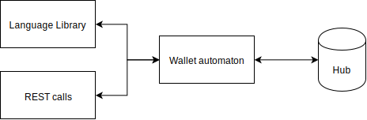
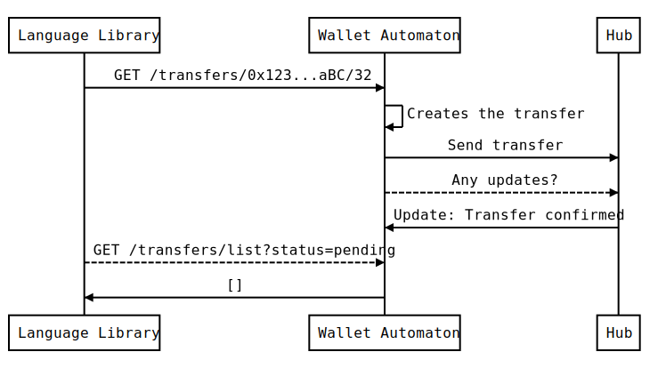

.. _header-n8742:

Liquidity SDK
-------------

Liquidity SDK allows you to easily integrate offchain payments and
exchanges within your application. It is divided in two different parts.
The **wallet automaton** is a self-hosted liquidity wallet management
tool for your transactions. The **Liquidity language library** allows
you to access wallet automaton directly from your favorite language or
from *REST* endpoints.

.. _header-n8746:

Architecture
~~~~~~~~~~~~

Liquidity is build around hubs creating a link between blockchain and
offchain transaction ecosystem. Blockchain remains the ultimate source
of trust in case of conflict while hub manage offchain state of network
participants. To leverage the complexity of an active state management,
the wallet automaton is querying the hub to get its last state. It
serves this up-to-date state through REST endpoint the language library
is using.

To give a more concrete example, the flow to perform a full transfer of
*32 wei* to a specific user is given below. Language Library is
considered to be the end user.

1. The user ask the automaton to perform a transfer of 32 wei

2. The automaton creates the transfer

3. The automaton sends the transfer

4. At regular interval, the automaton checks if the hub has included the
   transfer

5. When the transfer is included in an update, the automaton notice it

6. When the user checks if there is any pending transfer, none is
   returned because its transfer has been performed

If something bad happends during the process, the user is able to
contact the automaton and perform security associated operations.

.. _header-n8764:

Wallet automaton
~~~~~~~~~~~~~~~~

Liquidity network provides you with a non custodian payment system. Its
core component is the wallet automaton through which the user can
perform operations on the network while remaining in control of its
funds. For applications looking to implement offchain payments, this
component handles communication with liquidity hub, checking it doesn't
behave badly.

In term of technology, the automaton is a docker container that
synchronises with the hub and provides various endpoints. All endpoints
are using the internal state of the automaton. Because the automaton is
hosted by the user and has the knowledge of its private key, it is able
to sign offchain transfer and leverage the complex verification process
that takes place.

.. _header-n8768:

Language library
~~~~~~~~~~~~~~~~

Liquidity language library is a convenient way to communicate with the
automaton. It wraps the provided REST API using language specific
features. For now, the language library is only available for Node.JS. If
you have build an implementation for a language you love, you can submit
an issue on `liquidity sdk
repo <https://github.com/liquidity-network/liquidity-sdk>`__.

In the transfer sequence described above, the user has to call the
automaton on a regular basis in order to know if it still has any
transfers pending. This active wait is not convenient and doesn't
integrate well within an application flow. To leverage it, Node.JS
library has created a transfer method that returns a promise which is
resolved when the transfer has been performed.

.. highlight:: javascript
.. code:: javascript

   const liquidity = require('liquidity-sdk')

   const to = '0x627306090abaB3A6e1400e9345bC60c78a8BEf57'
   const amount = 32

   const performedTransfer = await liquidity.transfers.send(to, amount)

   console.log(`Tranfer has been ${performedTranfer}`)
.. highlight:: none
